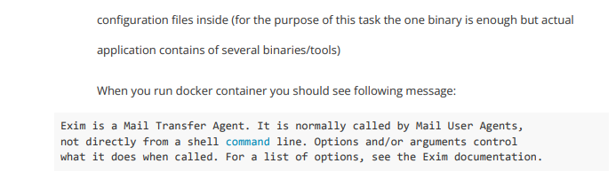

# Dockerfile for Exim Mail Transfer Agent

## Task description

### Task specifications

### Required structure of Dockerfile

## Implementation

My purpose is to create lightweight final docker image using multistage 
Dockerfile

I used `ubuntu:20.04` images that weights `~73mb`. 

### First image
The first image installs all dependencies and prepares artifacts for second image

### Second image
The final image copies artifacts from first image

It weights `~120mb`

The image runs with user `exim` who does not have superuser access 
to decrease the attack surface

